# 🎯 Habit Tracker App

A comprehensive **Flutter-based habit tracking application** designed to help users build positive habits, track their progress, and stay motivated with daily inspiration. Built with modern Material Design 3 principles and comprehensive dark/light theme support.


## 📸 Screenshots

### 🚀 **App Launch & Authentication**
<table>
  <tr>
    <td align="center">
      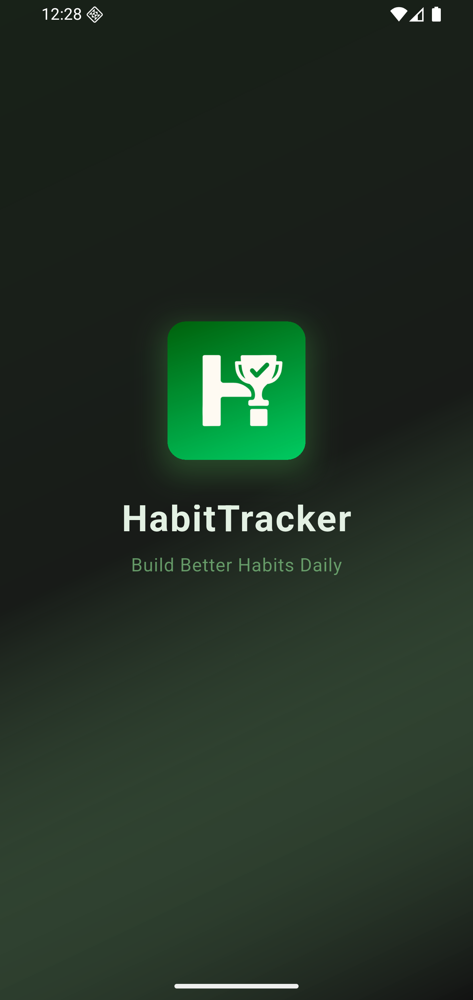
      <br><b>Splash Screen</b>
      <br><i>Beautiful animated logo with smooth transitions</i>
    </td>
    <td align="center">
      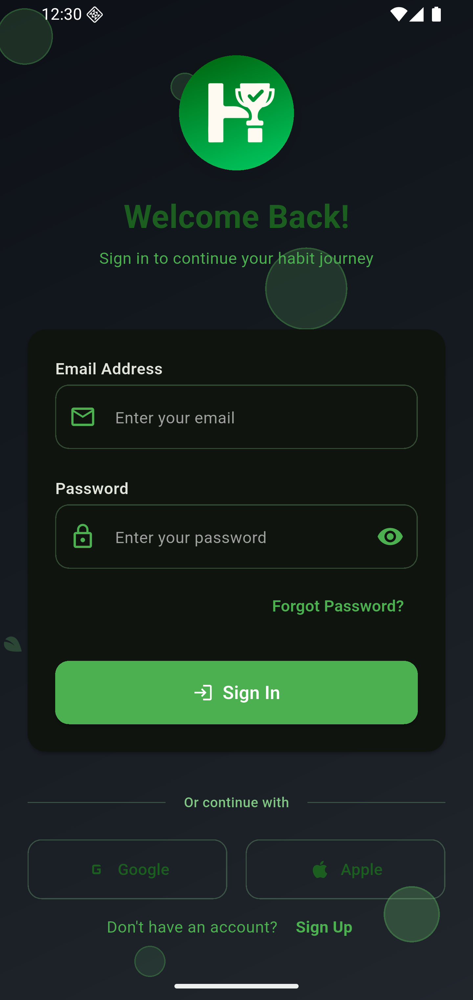
      <br><b>Login Screen</b>
      <br><i>Clean authentication with Google Sign-In</i>
    </td>
    <td align="center">
      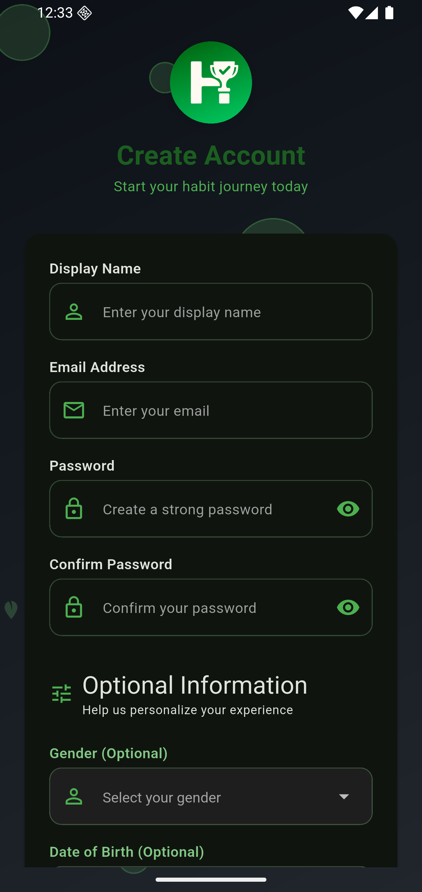
      <br><b>Register Screen</b>
      <br><i>Comprehensive signup with optional fields</i>
    </td>
  </tr>
</table>

### 🏠 **Home Dashboard**
<table>
  <tr>
    <td align="center">
      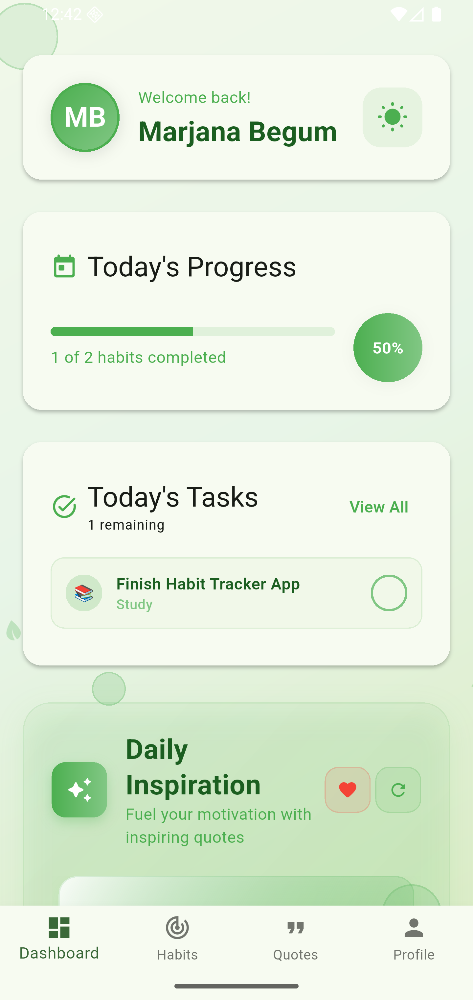
      <br><b>Home - Light Mode</b>
      <br><i>Dashboard with progress tracking & inspiration</i>
    </td>
    <td align="center">
      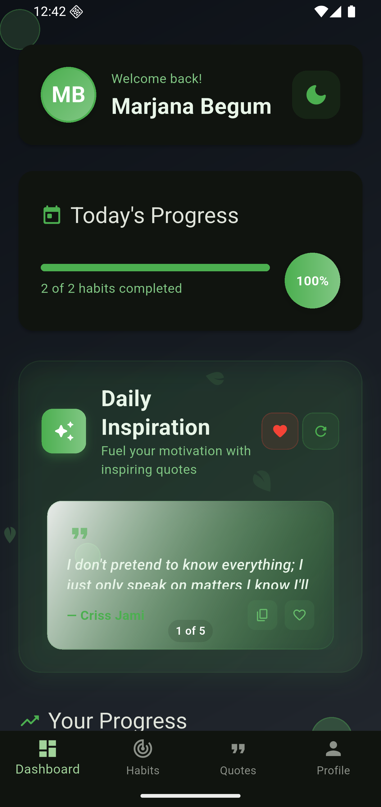
      <br><b>Home - Dark Mode</b>
      <br><i>Beautiful dark theme with proper contrast</i>
    </td>
    <td align="center">
      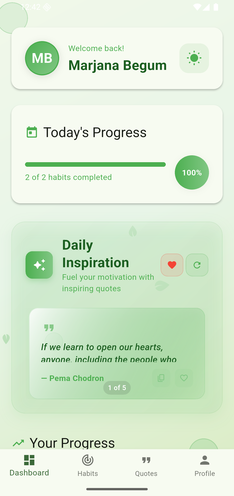
      <br><b>Daily Inspiration</b>
      <br><i>Premium quote cards with animations</i>
    </td>
  </tr>
</table>

### 🎯 **Habit Management**
<table>
  <tr>
    <td align="center">
      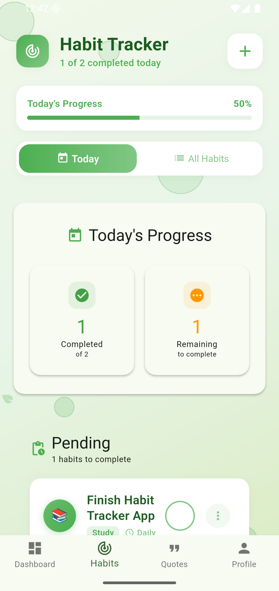
      <br><b>Habits Overview</b>
      <br><i>Today/All habits with completion tracking</i>
    </td>
    <td align="center">
      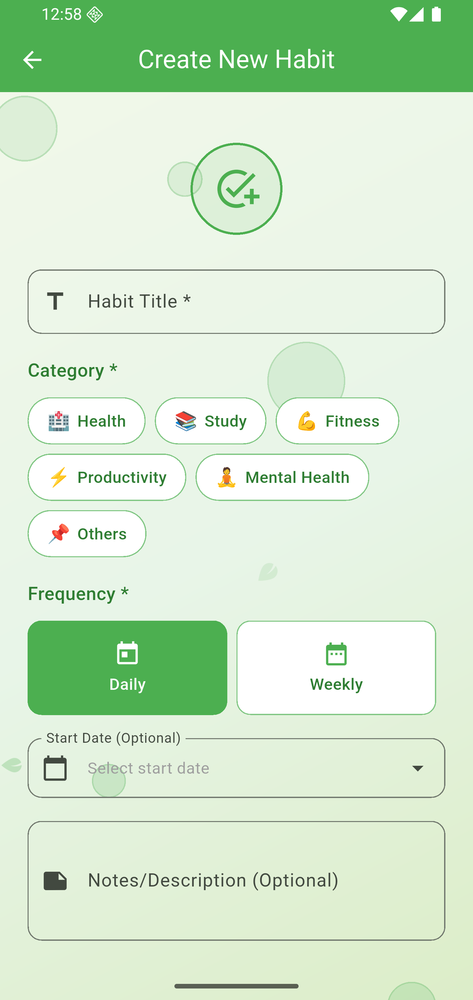
      <br><b>Create Habit</b>
      <br><i>Easy habit creation with categories</i>
    </td>
    <td align="center">
      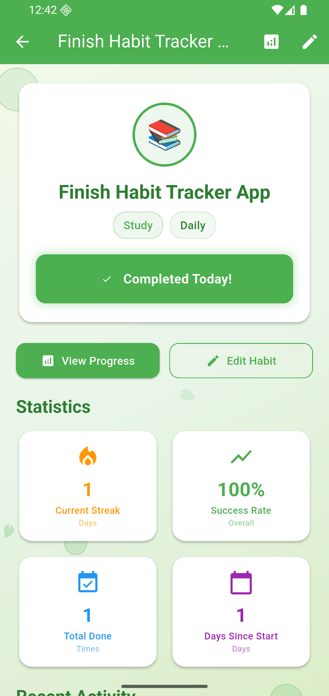
      <br><b>Habit Details</b>
      <br><i>Progress charts and statistics</i>
    </td>
  </tr>
</table>

### 📊 **Progress & Analytics**
<table>
  <tr>
    <td align="center">
      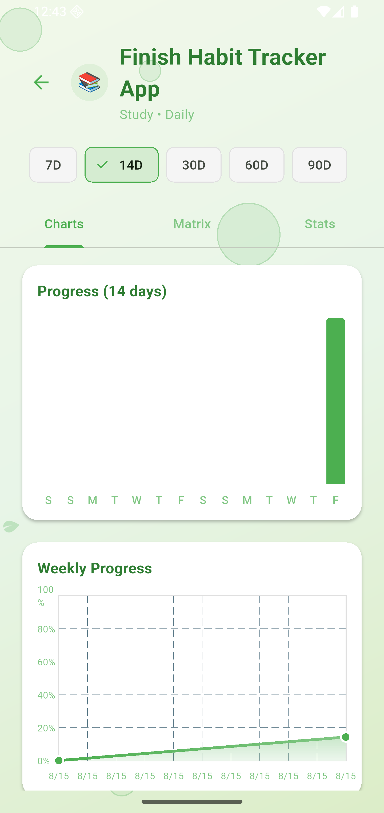
      <br><b>Progress Charts</b>
      <br><i>Visual analytics with FL Chart</i>
    </td>
    <td align="center">
      
      <br><b>Completion Animation</b>
      <br><i>Satisfying feedback animations</i>
    </td>
    <td align="center">
      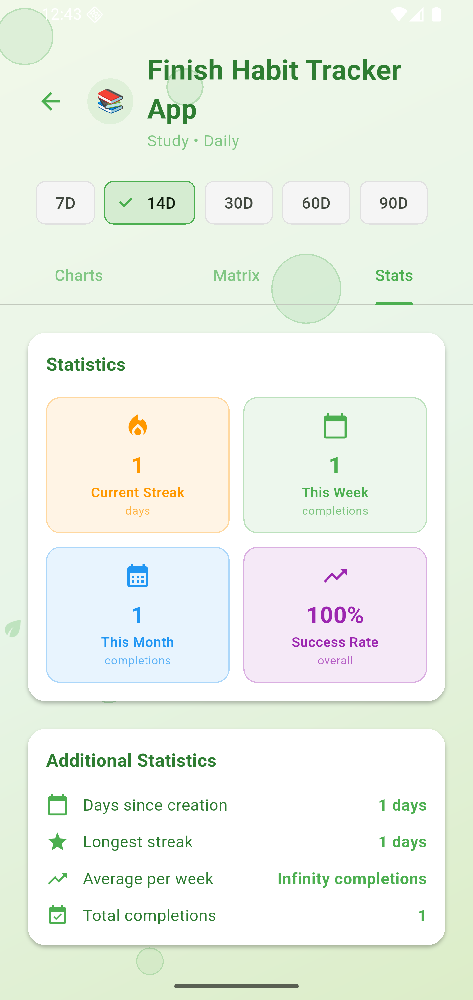
      <br><b>Streak Tracking</b>
      <br><i>Motivational streak counters</i>
    </td>
  </tr>
</table>

### 💭 **Quotes & Inspiration**
<table>
  <tr>
    <td align="center">
      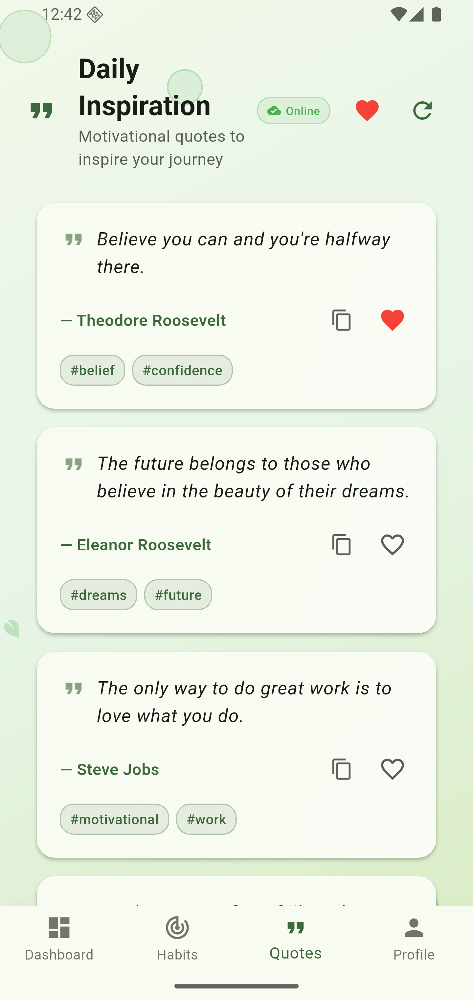
      <br><b>Favorite Quotes</b>
      <br><i>Personal collection management</i>
    </td>
    <td align="center">
      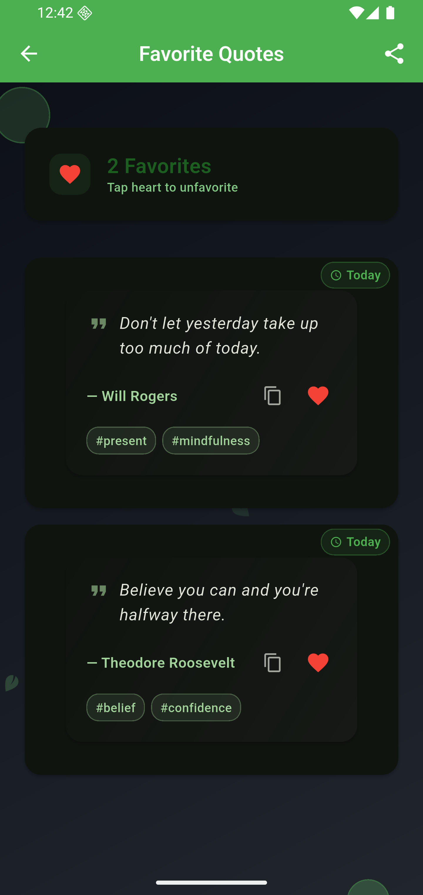
      <br><b>Quote Interactions</b>
      <br><i>Copy, favorite, and share options</i>
    </td>
  </tr>
</table>

### 👤 **Profile & Settings**
<table>
  <tr>
    <td align="center">
      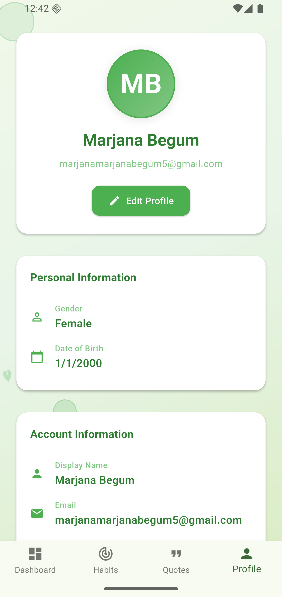
      <br><b>User Profile</b>
      <br><i>Profile management and statistics</i>
    </td>
    <td align="center">
      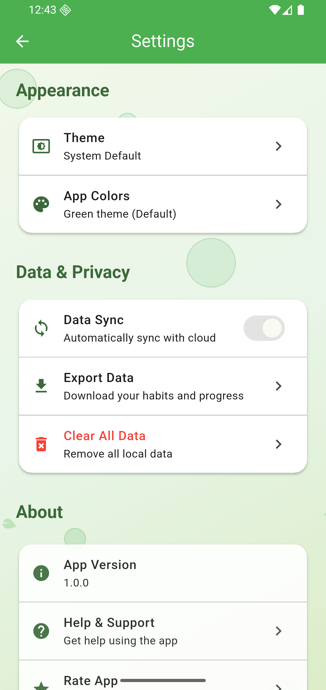
      <br><b>Settings</b>
      <br><i>Theme, preferences, and data options</i>
    </td>
    <td align="center">
      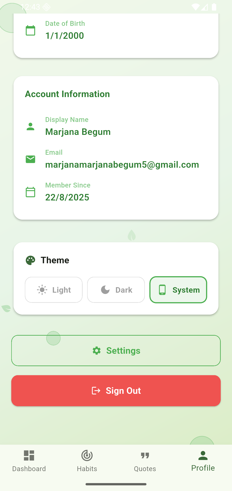
      <br><b>Theme Toggle</b>
      <br><i>Smooth light/dark/system mode switching</i>
    </td>
  </tr>
</table>

---

## 📱 Key Features

### 🎨 **Modern UI/UX**
- **Material Design 3** with beautiful animations
- **Comprehensive Dark/Light/System Theme Support** with one-tap toggle
- **Responsive Design** optimized for various screen sizes
- **Smooth Animations** using Flutter Animate package
- **Context-aware Design System** with consistent styling

### 🏠 **Home Dashboard**
- **Welcome Section** with user profile and theme toggle
- **Today's Progress** with visual progress indicators
- **Quick Task Management** with inline completion
- **Enhanced Daily Inspiration** with premium quote cards
- **Statistics Overview** with habit completion metrics
- **Quick Actions** for creating new habits

### 🎯 **Habit Management**
- **Create & Edit Habits** with custom categories and frequencies
- **6 Predefined Categories**: Health 🏥, Study 📚, Fitness 💪, Productivity ⚡, Mental Health 🧘, Others 📌
- **Flexible Scheduling**: Daily and Weekly frequencies
- **Progress Tracking** with detailed statistics
- **Streak Counting** to maintain motivation
- **Habit Completion Animations** with visual feedback

### 💭 **Daily Inspiration System**
- **Dual API Integration**: Quotable.io and ZenQuotes.io
- **Smart Quote Rotation** with automatic failover
- **Interactive Quote Cards** with copy & favorite features
- **Offline Quote Caching** for uninterrupted experience
- **Personal Quote Collections** with favorites system
- **Real-time Sync** across devices

### 👤 **User Management**
- **Firebase Authentication** with Google Sign-In
- **User Profile Management** with avatar support
- **Settings & Preferences** with theme persistence
- **Multi-device Synchronization** via Firestore

### 🌐 **Offline Support**
- **Smart Connectivity Detection**
- **Local Data Caching** with SharedPreferences
- **Offline-first Architecture** with sync capabilities
- **Status Indicators** for connection state

## 🏗️ Architecture

### **Design Patterns**
- **Provider Pattern** for state management
- **Repository Pattern** for data layer abstraction
- **Service Layer Architecture** for business logic
- **Component-based UI** with reusable widgets

### **Core Components**

#### 📁 **Providers**
```dart
├── AuthProvider          // User authentication state
├── HabitProvider        // Habit management & statistics
├── QuotesProvider       // Quote fetching & favorites
└── ThemeProvider        // Theme management & persistence
```

#### 🛠️ **Services**
```dart
├── AuthService          // Firebase Auth operations
├── HabitService         // Habit CRUD operations
├── QuotesService        // External API integration
├── LocalStorageService  // Caching & offline storage
└── ConnectivityService  // Network status monitoring
```

#### 🎨 **Design System**
```dart
├── AppColors            // Color palette with dark/light variants
├── AppTextStyles        // Typography with context-aware styling
├── AppSpacing           // Consistent spacing values
├── AppRadius            // Border radius constants
├── AppShadows           // Elevation & shadow effects
└── Enhanced Components  // Custom widgets (Cards, Buttons, etc.)
```

## 📱 Screens & Components

### 🏠 **Home Screen**
**Components:**
- **Welcome Header** with profile image and theme toggle
- **Progress Tracker** with animated progress bars
- **Daily Tasks Quick Actions** with inline completion
- **Enhanced Daily Inspiration** with premium quote cards
- **Statistics Cards** showing habits, streaks, and completion rates
- **Quick Create Button** for new habits

**Features:**
- Real-time progress updates
- Pull-to-refresh functionality  
- Smooth page animations
- Interactive quote management

---

### 🎯 **Habits Screen**
**Components:**
- **Tabbed Interface** (Today / All Habits)
- **Enhanced Habit Cards** with category icons
- **Progress Indicators** and streak counters
- **Quick Action Buttons** (Edit, Delete, Complete)
- **Floating Action Button** for creating habits
- **Empty State Illustrations**

**Features:**
- Filter habits by completion status
- Swipe actions for quick operations
- Visual completion animations
- Category-based organization

---

### 💭 **Daily Inspiration Section**
**Components:**
- **Premium Quote Cards** with gradient backgrounds
- **Action Buttons**: Copy, Favorite, Refresh
- **Page Indicators** for navigation
- **Status Badges** (Online/Offline)
- **Loading States** with custom animations
- **Empty State** with call-to-action

**Features:**
- Swipeable quote carousel
- One-tap copy to clipboard
- Instant favorite toggling
- Smooth API failover

---

### ⚙️ **Settings & Profile**
**Components:**
- **Profile Management** with avatar upload
- **Theme Selection** (Light/Dark/System)
- **Account Settings** and preferences
- **Data Management** options
- **About Section** with app information

**Features:**
- Real-time theme switching
- Profile data synchronization
- Export/import capabilities

---

### 🔐 **Authentication**
**Components:**
- **Login/Register Forms** with validation
- **Google Sign-In Integration**
- **Password Recovery** functionality
- **Loading States** and error handling

**Features:**
- Secure Firebase Auth
- Social authentication
- Persistent login state
- Form validation

## 🛠️ Technical Stack

### **Frontend**
- **Flutter 3.8.0** - UI Framework
- **Dart 3.8.0** - Programming Language
- **Material Design 3** - Design System
- **Flutter Animate 4.3.0** - Advanced Animations
- **Provider 6.1.1** - State Management

### **Backend & Services**
- **Firebase Core 3.6.0** - Backend Infrastructure
- **Firebase Auth 5.3.1** - Authentication
- **Cloud Firestore 5.4.3** - Database
- **Google Sign-In 6.2.1** - Social Authentication

### **External APIs**
- **Quotable API** - Primary quote source
- **ZenQuotes API** - Secondary quote source with failover

### **Storage & Caching**
- **SharedPreferences 2.2.2** - Local storage
- **HTTP 1.1.0** - API communication
- **Smart Caching System** - Offline support

### **UI & Animations**
- **FL Chart 0.68.0** - Progress visualization
- **Lottie 2.7.0** - Complex animations
- **Flutter Animate 4.3.0** - UI transitions

## 🚀 Getting Started

### **Prerequisites**
- Flutter SDK 3.8.0 or higher
- Dart SDK 3.8.0 or higher  
- Android Studio / VS Code with Flutter extensions
- Firebase project with Authentication and Firestore enabled

### **Installation**

1. **Clone the repository**
```bash
git clone <repository-url>
cd habittrackerapp
```

2. **Install dependencies**
```bash
flutter pub get
```

3. **Configure Firebase**
   - Create a new Firebase project
   - Enable Authentication (Email/Password + Google Sign-In)
   - Enable Cloud Firestore
   - Download `google-services.json` (Android) / `GoogleService-Info.plist` (iOS)
   - Place configuration files in appropriate directories

4. **Run the application**
```bash
flutter run
```

### **Build Commands**
```bash
# Debug build
flutter run

# Release build  
flutter build apk --release
flutter build ios --release

# Install specific device
flutter install -d <device-id>
```

## 📊 Data Models

### **Habit Model**
```dart
class Habit {
  String id;
  String title;
  String description;
  HabitCategory category;
  HabitFrequency frequency;
  DateTime createdAt;
  Map<String, bool> completions;
  int currentStreak;
  int maxStreak;
}

enum HabitCategory {
  health('Health', '🏥'),
  study('Study', '📚'),
  fitness('Fitness', '💪'),
  productivity('Productivity', '⚡'),
  mentalHealth('Mental Health', '🧘'),
  other('Others', '📌');
}
```

### **Quote Model**
```dart
class Quote {
  String id;
  String content;
  String author;
  List<String> tags;
  int length;
}

class FavoriteQuote extends Quote {
  DateTime favoritedAt;
}
```

### **User Model**  
```dart
class AppUser {
  String uid;
  String email;
  String? displayName;
  String? photoURL;
  DateTime createdAt;
  DateTime lastLoginAt;
}
```

## 🎨 Design System

### **Color Palette**
```dart
// Primary Colors
static const primary = Color(0xFF4CAF50);      // Green
static const primaryLight = Color(0xFF81C784);  // Light Green  
static const primaryDark = Color(0xFF2E7D32);   // Dark Green

// Context-Aware Colors (Dark/Light Mode)
static Color backgroundFor(BuildContext context);
static Color surfaceFor(BuildContext context);
static Color textPrimaryFor(BuildContext context);
```

### **Typography**
```dart
// Headlines
static const headline1 = TextStyle(fontSize: 32, fontWeight: FontWeight.bold);
static const headline2 = TextStyle(fontSize: 24, fontWeight: FontWeight.bold);
static const headline3 = TextStyle(fontSize: 20, fontWeight: FontWeight.w600);

// Body Text
static const bodyLarge = TextStyle(fontSize: 16, fontWeight: FontWeight.normal);
static const bodyMedium = TextStyle(fontSize: 14, fontWeight: FontWeight.normal);
static const caption = TextStyle(fontSize: 12, fontWeight: FontWeight.w500);
```

### **Spacing System**
```dart
static const double xs = 4.0;   // Extra Small
static const double sm = 8.0;   // Small  
static const double md = 16.0;  // Medium
static const double lg = 24.0;  // Large
static const double xl = 32.0;  // Extra Large
static const double xxl = 48.0; // Double Extra Large
```

## 🔧 Advanced Features

### **Smart Quote System**
- **Dual API Integration** with automatic failover
- **Intelligent Caching** with expiration management  
- **Tag-based Categorization** for personalized content
- **Real-time Synchronization** across devices
- **Offline-first Architecture** with seamless transitions

### **Progress Analytics**
- **Streak Tracking** with motivational milestones
- **Completion Rate Calculations** with trend analysis
- **Visual Progress Charts** using FL Chart
- **Historical Data Visualization** with interactive graphs
- **Export Functionality** for data portability

### **Theme System**
- **Dynamic Theme Switching** with smooth transitions
- **System Theme Detection** for automatic adaptation
- **User Preference Persistence** across app sessions
- **Context-aware Components** that adapt to theme changes
- **Cross-device Synchronization** via Firebase

### **Offline Capabilities**  
- **Smart Data Caching** with LRU eviction
- **Conflict Resolution** for concurrent modifications
- **Background Synchronization** when connectivity returns
- **Visual Status Indicators** for user awareness
- **Graceful Degradation** of functionality

## 🧪 Testing Strategy

### **Unit Tests**
- Model validation and serialization
- Business logic in services and providers
- Utility functions and helpers

### **Widget Tests**  
- Component rendering and interactions
- State management validation
- Navigation flow testing

### **Integration Tests**
- End-to-end user workflows
- API integration validation  
- Database operations testing

## 🚀 Performance Optimizations

### **Memory Management**
- **Lazy Loading** of heavy components
- **Image Caching** with automatic cleanup
- **Efficient State Management** with selective rebuilds
- **Memory-efficient Collections** for large datasets

### **Network Optimization**
- **Smart Caching Strategies** with TTL management
- **Request Deduplication** for concurrent calls
- **Compression** for large data transfers
- **Offline Queue** for failed requests

### **UI Performance**
- **Widget Rebuilding Optimization** with const constructors
- **Animation Performance** with native transitions
- **Lazy Loading Lists** for better scrolling
- **Image Optimization** with automatic resizing

## 📝 Contributing

1. **Fork the repository**
2. **Create feature branch**: `git checkout -b feature/amazing-feature`
3. **Commit changes**: `git commit -m 'Add amazing feature'`
4. **Push to branch**: `git push origin feature/amazing-feature`  
5. **Open Pull Request** with detailed description

### **Code Style Guidelines**
- Follow **Dart Style Guide** conventions
- Use **meaningful variable names** and comments
- Maintain **consistent indentation** (2 spaces)
- Write **comprehensive documentation** for public APIs
- Include **unit tests** for new functionality

## 📄 License

This project is licensed under the **MIT License** - see the [LICENSE](LICENSE) file for details.

## 🙏 Acknowledgments

- **Flutter Team** for the amazing framework
- **Firebase Team** for robust backend services  
- **Quotable.io & ZenQuotes.io** for inspirational quote APIs
- **Material Design Team** for design guidelines
- **Open Source Community** for invaluable packages and resources

## 📞 Support

For support, please open an issue on GitHub or contact the development team.

---

**Built with ❤️ using Flutter & Firebase**

*A modern, feature-rich habit tracking application designed to help users build better habits and achieve their goals through consistent daily actions and motivational content.*
